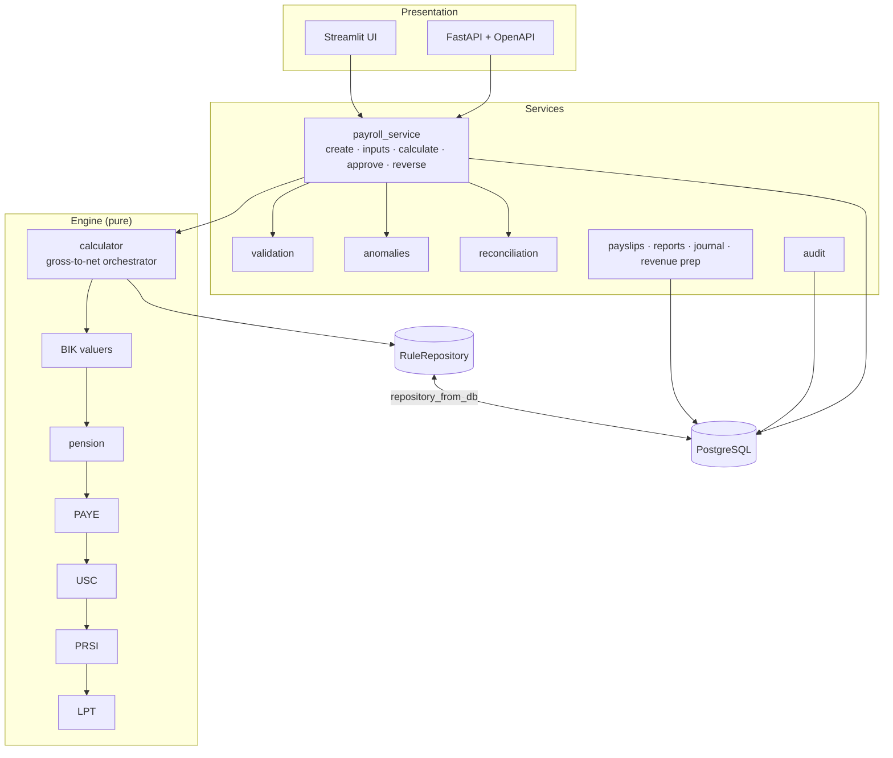
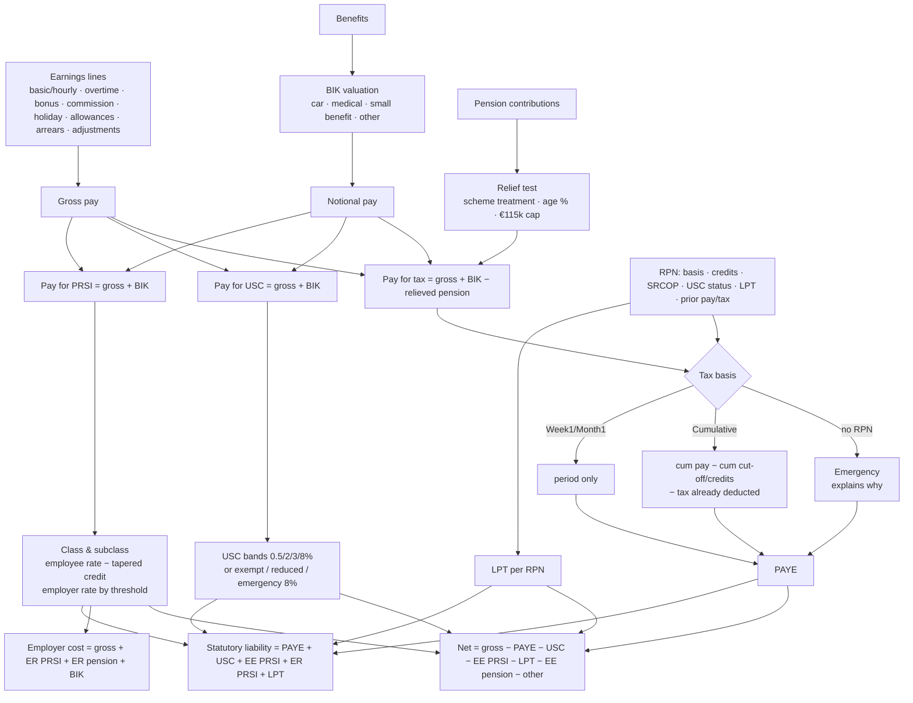
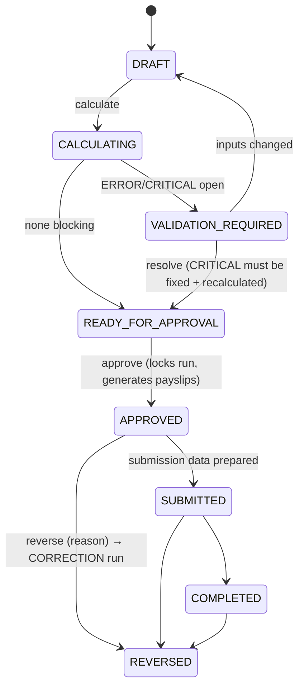

# Architecture

## Principles

1. **Separate the layers** — payroll data, statutory rules, calculation engine, validation, reporting, UI and external integrations never mix.
2. **Rules are data** — no statutory rate appears in Python code. The engine asks the rule repository for "`PRSI.class_A` in force on 2026‑10‑23".
3. **Refuse rather than guess** — missing/invalid/unverified inputs or rules raise `CalculationBlocked` with a code and a human message; the employee is marked `MISSING`, `INVALID` or `UNVERIFIED`, never silently calculated.
4. **Explain everything** — each component appends `TraceStep`s (component, step, description, calculation, result, rate, rule reference incl. source URL).
5. **The engine is testable on its own** — pure dataclasses in, dataclass out; no database, no UI.

## Repository layout

```
app/
  core/        config (env-only secrets), logging (PPSN/secret redaction), security (bcrypt, JWT, RBAC, masking)
  rules/       repository.py (effective-dated, verification-gated) + data/ie_2025.json, ie_2026.json
  engine/      types, money (Decimal), context, paye, usc, prsi, components (LPT/pension/BIK), calculator (gross-to-net)
  db/          SQLAlchemy 2 models (23 tables), session handling
  services/    payroll_service (workflow + bulk), validation, anomalies, reconciliation, payslips, reports,
               revenue (submission prep + gateway interface), analytics, employees (RPN import), audit, seed
  api/         FastAPI app + routers (core, payroll, admin), JWT dependencies, Pydantic schemas
ui/            Streamlit app (15 role-aware pages) using the same service layer
migrations/    Alembic (initial schema generated against PostgreSQL 16)
scripts/       seed, benchmark, export_examples
tests/         engine (pure), services (DB), api
```

## Component diagram



## Payroll calculation flow



## Run workflow



## Key design decisions

| Decision | Why |
|---|---|
| `Decimal` everywhere, half-up to the cent; periodised cut-offs/credits rounded **up** | Money must be exact; round-up is Revenue's own published convention (€44,000/52 → €846.16). |
| Rules selected by **payment date** | Revenue taxes by pay date; the 1 Oct 2026 PRSI change is applied per pay date without code changes. |
| YTD snapshot stored on every result | The next period reads one row per employee (one query for the whole run), and a correction run rebuilds from the prior period instead of stacking. |
| Trace stored as JSON on the result | "Why was PAYE €533.32?" is answered from the stored trace — the explanation can never drift from the figure. |
| Streamlit UI calls the service layer directly; FastAPI exposes the same services | Fast MVP UI while keeping a production-shaped API; a React front end can replace Streamlit without touching the engine. |
| Same schema on SQLite and PostgreSQL (JSON → JSONB variant) | Zero-setup local demo; PostgreSQL for anything real. Test suite passes on both. |
| One table per rule family (`tax_rules`, `usc_rules`, `prsi_rules`, …) with identical columns | Matches the requested schema while `repository_from_db` merges them into one repository. |

## Performance

Measured with `python -m scripts.benchmark` (see [TESTING.md](TESTING.md)): the engine takes ~0.3–0.4 ms per employee; a full 300-employee run (load, calculate, persist results + traces, validation, anomaly detection, reconciliation) takes under 1 s on SQLite and PostgreSQL. Bulk loading uses `selectinload` and a single YTD query per run to avoid N+1 queries; indexes cover run/employee/status lookups.
