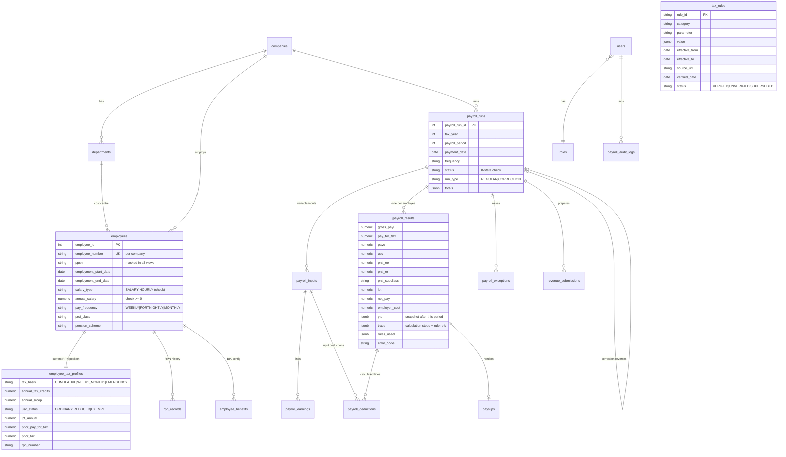

# Database schema

PostgreSQL-first (JSONB for traces/payloads), portable to SQLite for the local demo. Created by Alembic
(`migrations/versions/*_initial_schema.py`, generated against PostgreSQL 16). 23 tables.

## ER diagram

## Tables

| Table | Purpose |
|---|---|
| `companies`, `departments` | Employer (registration number, frequency, financial year) and cost centres with monthly budgets |
| `employees` | Master data. Only a masked IBAN placeholder is stored — no full bank details in the MVP |
| `employee_tax_profiles` | Current RPN-derived position used by the engine (unique per employee) |
| `rpn_records` | Every imported RPN (history, raw row, import timestamp, source) |
| `employee_benefits` | Recurring BIK configuration valued each period |
| `payroll_runs` | Run header, status machine (CHECK constraint), totals JSON, timing |
| `payroll_inputs` / `payroll_earnings` | Variable inputs per employee per run (unique run+employee) |
| `payroll_deductions` | Input deductions (`input_id`) and calculated deduction lines (`result_id`); CHECK amount ≥ 0 |
| `payroll_results` | One row per employee per run: every pay base, deduction, employer figure, YTD snapshot, trace, rules used, error code |
| `payroll_exceptions` | ENGINE / VALIDATION / ANOMALY / RECONCILIATION items with severity CHECK and resolution |
| `payroll_audit_logs` | User, timestamp, action, entity, before/after (sanitised), reason |
| `payslips` | Rendered HTML per approved result |
| `revenue_submissions` | Prepared submission payload, validation errors, status |
| `tax_rules`, `usc_rules`, `prsi_rules`, `lpt_rules`, `pension_rules`, `bik_rules` | Identical rule columns per family (PAYE + emergency rules live in `tax_rules`) |
| `users`, `roles` | Hashed passwords, role codes and their permission lists |

## Integrity & indexes

* Unique: `(company_id, employee_number)`, `(payroll_run_id, employee_id)` on inputs and results, `(employee_id, rpn_number)`, `tax_registration_number`, `submission_ref`, user email.
* CHECK constraints: salary/rate ≥ 0, salary type, pay frequency, run status, exception severity, deduction amount ≥ 0.
* Foreign keys enforced on both PostgreSQL and SQLite (`PRAGMA foreign_keys=ON`).
* Indexes on all foreign keys, run status, `(company_id, tax_year, frequency, payroll_period)`, audit timestamp/action, rule `tax_year`/`rule_set_id`.
* The service layer additionally prevents two REGULAR runs for the same company/year/frequency/period.
